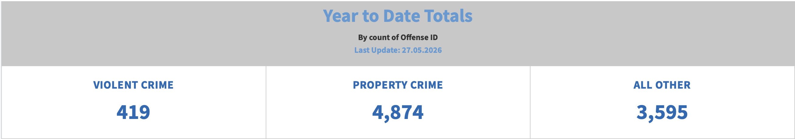
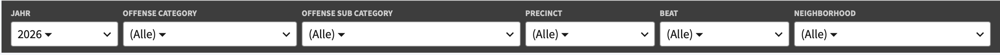
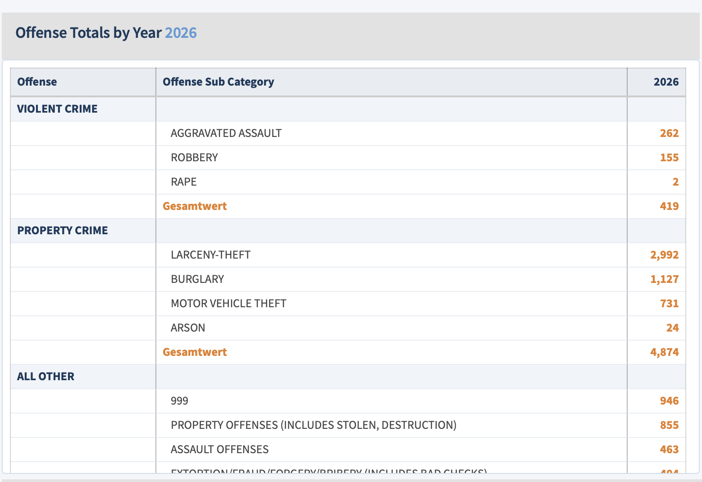
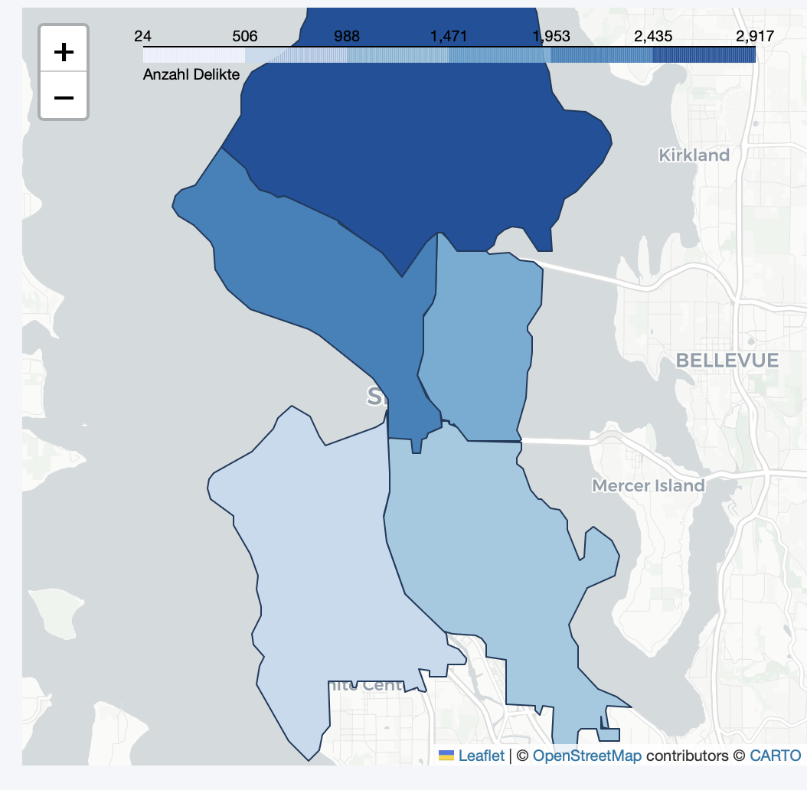
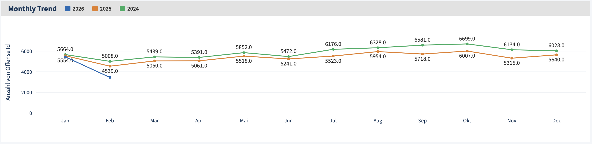

# Seattle Crime Dashboard

> Open-Source Nachbau des [Seattle Police Department Crime Dashboards](https://www.seattle.gov/police/information-and-data/data/crime-dashboard)  
> Modul: Datenaufbereitung und Visualisierung | THWS | Felix Beck

🔗 **Live-Demo:** [crime-dashboard-eiyustjjxtgdrhvnruzwsb.streamlit.app](https://crime-dashboard-eiyustjjxtgdrhvnruzwsb.streamlit.app)

---

## Projektbeschreibung

Dieses Projekt ist eine vollständige Open-Source-Nachbildung des öffentlich zugänglichen Crime Dashboards der Stadt Seattle, das ursprünglich mit proprietären Tools (ArcGIS / Tableau) umgesetzt wurde.

**Ziel:** Der gesamte Nachbau – von der Rohdatenaufbereitung bis zum interaktiven Dashboard – ausschließlich mit freien, quelloffenen Werkzeugen nachbauen.

Das Original-Dashboard basiert auf **Tableau** ([Fallstudie](https://www.tableau.com/solutions/workbook/visualizing-crime-and-increasing-transparency-in-seattle)) 
und **ArcGIS** ([Dashboard](https://www.arcgis.com/home/item.html?id=241ee9264d4b4d9e8ab902a78e19a48c)).

---

## Tech Stack

| Tool | Version | Zweck |
|------|---------|-------|
| Python | 3.12 | Programmiersprache |
| Streamlit | ≥ 1.30 | Web-Interface |
| DuckDB | ≥ 0.9 | Datenbank & SQL-Abfragen |
| Pandas | ≥ 2.0 | Datenverarbeitung |
| Plotly | ≥ 5.0 | Zeitreihen & Charts |
| Folium | ≥ 0.15 | Interaktive Karte |
| streamlit-folium | ≥ 0.18 | Folium in Streamlit |
| GitHub Actions | – | Tägliche automatische Aktualisierung der Datenbank |

---

## Datenbasis

**Datensatz:** [SPD Crime Data: 2008–Present](https://data.seattle.gov)  
**Bereitgestellt von:** Seattle Police Department  
**Lizenz:** Public Domain

| Merkmal | Wert |
|---------|------|
| Zeilen (gesamt) | 1.54 M |
| Zeilen (bereinigt) | 1.296.053 (85%) |
| Spalten | 20 |
| Zeitraum | 2008 – heute |
| Dateigröße | ca. 382 MB |

> Werte beziehen sich auf den ursprünglichen Aufbau. Durch die tägliche automatische Aktualisierung (siehe [Deployment](#deployment--automatische-aktualisierung)) wächst der Datensatz laufend weiter.

---

## Projektstruktur

```
crime-dashboard/
├── sc_dashboard neu.py        ← Streamlit App (Hauptdatei)
├── crime_db.py                ← Datenaufbereitung & DuckDB Import
├── crimes_historical.parquet  ← Historische Daten 2008–2023 (im Repo)
├── .github/workflows/
│   └── update-db.yml          ← Tägliche Automatisierung (GitHub Actions)
├── requirements.txt           ← Python Pakete
├── .gitignore                 ← CSV & DB ausgeschlossen
└── README.md                  ← Diese Datei
```

> **Hinweis:** Die fertige Datenbank (`seattle_crime.db`, ca. 250 MB) ist aus Größengründen nicht im Repository enthalten (`.gitignore`). Für den lokalen Betrieb wird sie mit `crime_db.py` selbst aufgebaut; die öffentliche App lädt sie automatisch von einem [GitHub Release](https://github.com/bfelix91/crime-dashboard/releases/tag/db-v1) herunter (siehe [Deployment](#deployment--automatische-aktualisierung)).

---

## Installation & Start

**1. Repository klonen:**
```bash
git clone git@github.com:bfelix91/crime-dashboard.git
cd crime-dashboard
```

**2. Pakete installieren:**
```bash
pip install -r requirements.txt
```

**3. Datenbank aufbauen:**
```bash
python crime_db.py
```
Lädt automatisch die historischen Daten (aus der im Repo enthaltenen `crimes_historical.parquet`) sowie alle aktuellen Fälle seit 2024 von der Seattle Open Data API – ein manueller CSV-Download ist nicht nötig.

**4. Dashboard starten:**
```bash
streamlit run "sc_dashboard neu.py"
```

---

## Deployment & automatische Aktualisierung

Die App läuft öffentlich auf [Streamlit Community Cloud](https://crime-dashboard-eiyustjjxtgdrhvnruzwsb.streamlit.app). Da die fertige Datenbank (~250 MB) das GitHub-Dateilimit sprengt und ohnehin per `.gitignore` ausgeschlossen ist, funktioniert die Aktualisierung so:

1. Ein täglicher **GitHub-Actions-Workflow** (`.github/workflows/update-db.yml`, 06:00 UTC) baut `seattle_crime.db` neu auf – historische Parquet-Daten plus aktuelle Fälle von der Seattle-API – und lädt sie als [GitHub-Release-Asset](https://github.com/bfelix91/crime-dashboard/releases/tag/db-v1) hoch.
2. Die Dashboard-App prüft beim (Neu-)Start, ob eine neuere Version vorliegt (per `Last-Modified`-Header, Cache-Intervall 24h), und lädt sie bei Bedarf automatisch herunter.

Damit bleibt das öffentliche Dashboard laufend aktuell, ohne dass manuell etwas nachgepflegt werden muss.

---

## Datenaufbereitung

### Qualitätsprobleme & Lösungen

| Problem | Umfang | Lösung |
|---------|--------|--------|
| `REDACTED` Koordinaten | ~220k Zeilen | Gefiltert |
| Dirty Dates (1900-01-01) | Vereinzelt | Jahr < 2008 gefiltert |
| Nullwerte Neighborhood/Precinct | Gering | Gefiltert |

### Bereinigungsschritt
```python
conn.execute("""
    CREATE TABLE IF NOT EXISTS crimes_clean AS
    SELECT *,
        EXTRACT(hour FROM strptime("Report DateTime", '%Y %b %d %I:%M:%S %p')) AS stunde,
        DAYOFWEEK(strptime("Report DateTime", '%Y %b %d %I:%M:%S %p')) AS wochentag,
        YEAR(strptime("Offense Date", '%Y %b %d %I:%M:%S %p')) AS jahr,
        MONTH(strptime("Offense Date", '%Y %b %d %I:%M:%S %p')) AS monat
    FROM crimes
    WHERE YEAR(strptime("Offense Date", '%Y %b %d %I:%M:%S %p')) >= 2008
        AND Latitude NOT IN ('REDACTED', '0')
        AND Longitude NOT IN ('REDACTED', '0')
""")
```

---

## Dashboard-Komponenten

### KPI-Karten
Drei Kennzahlen direkt unterhalb des Headers:

&nbsp;

| Karte | Inhalt |
|-------|--------|
| Violent Crime | Absolute Anzahl Gewaltdelikte |
| Property Crime | Absolute Anzahl Eigentumsdelikte |
| All Other | Absolute Anzahl sonstiger Delikte |

### Filter-System
6 interaktive Popover-Filter in einer kompakten dunklen Leiste:
&nbsp;

&nbsp;
- **Jahr** – 2008 bis 2026
- **Offense Category** – VIOLENT CRIME, PROPERTY CRIME, ALL OTHER
- **Offense Sub Category** – Granulare Deliktarten
- **Precinct** – 5 Polizeibezirke
- **Beat** – Untereinheiten der Precincts
- **Neighborhood** – 70+ Stadtteile


### Offense Totals Tabelle

Gruppierte Tabelle nach Kategorie → Subkategorie mit einer Spalte pro ausgewähltem Jahr. Neuestes Jahr wird orange hervorgehoben.


### Crime Hotspot-Karte
Interaktive Folium-Karte mit Choropleth-Darstellung nach Precinct (GeoJSON via GitHub). Fallback: Neighborhood-Karte mit skalierten Kreisen.



### Monthly Trend
Zeitreihen-Chart mit einer Linie pro Jahr, Datenpunkten mit Werten direkt auf der Linie, automatischem Ausblenden überlappender Labels.



---

## Vergleich: Original vs. Nachbau

| Komponente | Original (Tableau) | Nachbau (Streamlit) |
|---|---|---|
| KPI-Karten | ✅ | ✅ |
| 6-Filter-System | ✅ | ✅ |
| Offense Totals Tabelle | ✅ | ✅ |
| Mehrjahres-Vergleich | ✅ | ✅ |
| Choropleth-Karte | ✅ | ✅ |
| Monthly Trend | ✅ | ✅ |
| Lizenzkosten | 💰 | ✅ kostenlos |
| Reproduzierbarkeit | ❌ | ✅ |

---

## Bekannte Einschränkungen

- **REDACTED-Koordinaten:** ~15% der Daten haben keine GPS-Koordinaten (Datenschutz)
- **Systemwechsel 2019:** RMS → NIBRS kann Brüche in Zeitreihen verursachen
- **Kein Echtzeit-Update:** Die Datenbank wird nur einmal täglich aktualisiert (GitHub-Actions-Cron), nicht live bei jedem neuen Fall
- **GeoJSON:** Offizielle Seattle Precinct-Grenzen waren nicht über die öffentliche API abrufbar

<!--
---

## Dokumentation

Eine ausführliche Dokumentation aller Schritte (Datenaufbereitung, Architektur, Visualisierungen, kritische Reflexion) ist im [Quarto Handout](handout.qmd) verfügbar.
-->

---

## Quellen

- [Seattle Open Data Portal](https://data.seattle.gov)
- [SPD Crime Dashboard (Original)](https://www.seattle.gov/police/information-and-data/data/crime-dashboard)
- [NIBRS Dokumentation](https://ucr.fbi.gov/nibrs/2019/resource-pages/nibrs_techspec-2019_f.pdf)
- [DuckDB Dokumentation](https://duckdb.org/docs)
- [Streamlit Dokumentation](https://docs.streamlit.io)
- [Claude (Anthropic)](https://claude.ai) – KI-Assistent für Code-Unterstützung und Dokumentation


KI-Unterstützung
Im Rahmen dieses Projekts wurde Claude (Anthropic) als KI-Assistent eingesetzt. 
Der Einsatz erfolgte für nachfolgende Bereiche:

Code-Unterstützung:
- Debugging von Fehlermeldungen (z.B. DuckDB-Verbindungsprobleme, Streamlit Cache-Fehler)
- Vorschläge für CSS-Styling des Dashboards, 
- Hilfe bei der Folium/Plotly Konfiguration

Dokumentation:
- Unterstützung bei der Erstellung des interaktiven Architektur-Diagramms sowie der README

Konzeptionelle Unterstützung:
- Diskussion der Datenbankwahl (DuckDB vs. Alternativen)
- Öffentlicher Zugang zu Streamlit
- Strategieberatung beim Deployment (Hybrid-Ansatz Parquet + API)


